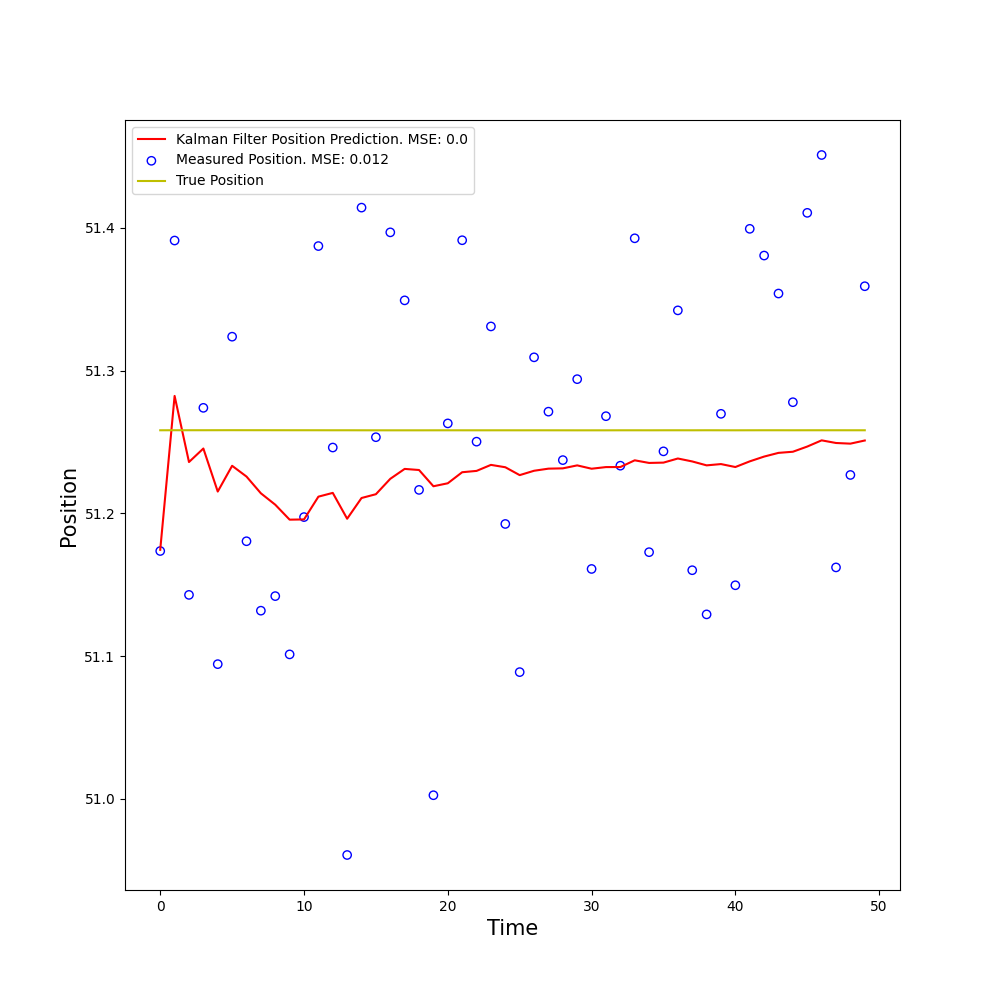
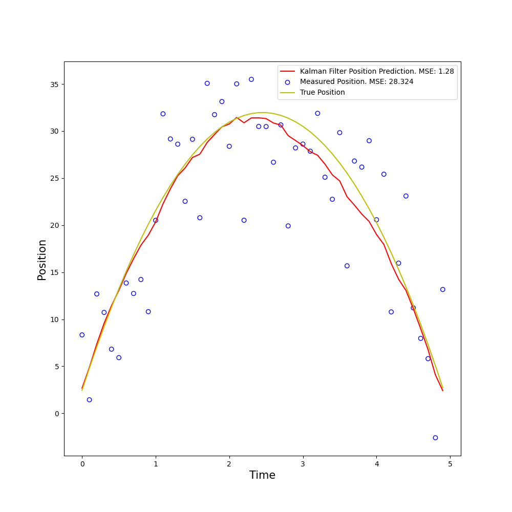

# kalman-filter

An implementation of the Kalman filter for predicting the dynamics of various systems based on state evolutions and noisy observations.

## How to run

1) Clone the repo.

2) `pip install -r requirements.txt`

3) Execute the file `kalman-filter.py`. This will generate a graph displaying the measured position, actual position, and predicted position via Kalman filter over time. Aditionally, the MSE of the measured position and the predicted position will be printed.

## Kalman Filter

The purpose of the Kalman filter is to estimate the state of a discrete process $x_k$ that updates by the equation

$$
x_k = A x_{k-1} + Bu_k + w_{k-1}
$$

from measurements $z_k$ where

$$
z_k = H x_k + v_k.
$$

The matrix $A$ is the state transition matrix that determines how the state evolves over time.

The vector $u_k$ is the optional control input, and $B$ is the control matrix maps the control input $u_k$ from the control space to the state space. Similarly, $H$ is the transformation matrix that transforms a state from the state space to the measurement space.

$w_k$ and $v_k$ are random vectors that represent process and measurement noise respectively. They are assumed to be independent of each other and have multinormal distributions such that 

$$
\begin{align}
w_k &\sim \mathcal{N}(0,Q) \\
v_k &\sim \mathcal{N}(0,R)
\end{align}
$$

where $Q$ are $R$ are the respective covariance matrices.

To find our state approximation $\hat{x}_k$, we first define the *a priori* state estimate
```math
\hat{x}_k^- = A\hat{x}_{k-1} + B u_k
```

The a priori state estimate $\hat{x}\_k^-$ is correct if we assume our previous estimate $\hat{x}\_{k-1}$ of our state was correct. That is, if $\hat{x}\_{k-1} = x\_{k-1}.$

In practice, we have not correctly identified the true state of the system, so our a priori estimate needs to be updated based on the residule of the measurement $z_k$ and how much it differs from the measurement prediction $H x_k^-$. That is, we need to find a matrix $K_k$ known as the *Kalman gain* that gives us our *a posteriori* estimate

```math
\hat{x}_k = \hat{x}_k^- + K_k(z_k - H \hat{x}_k^-).
```

How do we find such a $K_k$? We first define the *a priori* and *a posteriori* estimate errors respectively
```math
\begin{align}
e_k^- &= x_k - \hat{x}_k^- \\
e_k &= x_k - \hat{x}_k.
\end{align}
```

Then the a priori and a posteriori estimate error covariances are respectively
```math
\begin{align}
P_k^- &= E[e_k^- e_k^{- \top}] \\
P_k &= E[e_k e_k^\top].
\end{align}
```

The choice of $K_k$ as a function of $P_k^-$ that minimized the a posteriori error covariance $P_k$ is then

```math
K_k = P_k^- H^\top (HP_k^-H^\top + R)^{-1}.
```

## Discrete Kalman Filter Algorithm

We can now define the discrete Kalman filter algorithm in three parts. At each step, we first calculate the a priori estimates. Next we calculate the Kalman gain, and finally we calculate the a posteriori estimates.

1. Calculate a priori state and covariance predictions
  ```math
  \begin{align}
    \hat{x}_k^- &= A\hat{x}_{k-1} + B u_k \\
    P_k^- &= AP_{k-1}A^\top + Q\\
  \end{align} 
  ```
2. Calculate Kalman gain
  ```math
  K_k = P_k^- H^\top (HP_k^-H^\top + R)^{-1} \\
  ```
3. Calculate a posteriori state and covariance predictions predictions
  ```math
  \begin{align}
    \hat{x}_k &= \hat{x}_k^- + K_k(z_k - H \hat{x}_k^-) \\
    P_k &= (I - K_kH)P_k^-
  \end{align}
  ```
## Systems

### Random Constant

The random constant system is a simple but illustrative example. The goal is to estimate a random constant with low process noise but high measurement noise.

The state does not change over time, so $A = 1$. There is no control input so there is no $u$ or $B$. The constant is measured directly so $H = 1$.

Running the simulation, we get the following results



### Projectile Motion

The projectile motion system models a solution to the ode $x'' = g$ where $x(t)$ is the position and the constant $g$ defaults to $-9.81$. Expanding with Taylor series, we get 

$$
x(t + \Delta t) = x(t) + \Delta t x'(t) + \frac{\Delta t ^2}{2} x''(t) + O(\Delta t ^3).
$$

Because $x''$ is constant, all higher order terms are zero.

Setting the discrete position $x_k = x(k \Delta t)$ and discrete velocity $v_k = x'(k \Delta t)$, we get the finite difference equations

$$
\begin{align}
x_{k+1} &= x_k + \Delta t v_k + \frac{\Delta t ^2}{2} g \\
v_{k+1} &= v_k + \Delta t g.
\end{align}
$$

The state vector is the position and velocity of the system
```math
\textbf{x}_k = \begin{bmatrix} x_k \\ v_k \end{bmatrix}.
```

We can formulate the above equations in matrix form
```math
\begin{bmatrix} x_{k+1} \\ v_{k+1} \end{bmatrix} = \begin{bmatrix} 1 & \Delta t \\ 0 & 1\end{bmatrix} \begin{bmatrix} x_k \\ v_k \end{bmatrix} + \begin{bmatrix} \frac{\Delta t ^2}{2} \\ \Delta t \end{bmatrix} g.
```

This means that the state transition matrix $A$, control matrix $B$, and control vector $u$ is
```math
\begin{align}
A &= \begin{bmatrix} 1 & \Delta t \\ 0 & 1\end{bmatrix} \\
B &= \begin{bmatrix} \frac{\Delta t ^2}{2} \\ \Delta t \end{bmatrix} \\
\mathbf{u} &= g.
\end{align}
```

Let us assume that our acceleration due to gravity has normally distributed noise with mean $0$ and standard deviation $\sigma_a = 0.25$. This means that the position and velocity also have normally distributed noise with standard deviation $\sigma_x = \frac{\Delta t^2}{2} \sigma_a$ and $\sigma_v = \Delta t \sigma_a$ respectively. So the process noise vector is

```math
\mathbf{w}_k = \begin{bmatrix} w_x \\ w_v \end{bmatrix}.
```

Where $w_x \sim \mathcal{N}(0,\sigma_x)$ and $w_v \sim \mathcal{N}(0, \sigma_v)$. Therefore, our process nosie covariance matrix $Q$ is

```math
Q = \begin{bmatrix}\sigma_x^2 & \sigma_x \sigma_v \\ \sigma_x \sigma_v& \sigma_v^2\end{bmatrix}.
```

We will only measure position in this system. Therefore, our transformation matrix $H$ is 

```math
H = \begin{bmatrix} 1 & 0\end{bmatrix}.
```

Let us assume that our measurement noise has standard deviation $\sigma_z = 5$. Then our measurement noise vector $\mathbf{v}_k$ is a scalar such that $\mathbf{v}_k \sim \mathcal{N}(0,\sigma_z).$ This implies that our measurement noise covariance matrix $R$ is also a constant and $R = \sigma_z^2$.

Running the simulation, we get the following results



### Dampened Oscillator

The dampened oscillator system solves the ode $mx'' + bx' + kx = 0$.

When $b^2 < 4mk$, the system is underdampened and will oscillate with exponentially decreasing amplitude. When $b^2 = 4mk$, the system is critically dampened and the amplitude decays as fast as possible. When $b^2 > 4mk$, the system is overdampened and will apporach equilibrium over a longer period of time. When $b = 0$, the system is undampened.

This system is similar to projectile motion as it is a second order ODE. Solving for $x''$ we get

```math
x'' = -\frac{b}{m}x' - \frac{k}{m}x.
```

Again by expanding with taylor series, substituting for $x''$, ignoring higher order terms, we get

$$
\begin{align}
x(t + \Delta t) &= x(t) + \Delta t x'(t) + \frac{\Delta t ^2}{2} x''(t) + O(\Delta t^3) \\
&= (1 - \frac{k}{2m} \Delta t ^2) x(t) + (\Delta t - \frac{b}{2m} \Delta t^2) x'(t) \\
x'(t + \Delta t) &= x'(t) + \Delta t x''(t) + \frac{\Delta t ^2}{2} x'''(t) + O(\Delta t^3) \\
&= x'(t) + \Delta t (-\frac{k}{m}x(t) - \frac{b}{m}x'(t)) + \frac{\Delta t ^2}{2} (\frac{bk}{m^2}x(t) + (\frac{b^2}{m^2} - \frac{k}{m})x'(t)) \\
&= (-\frac{k}{m} \Delta t + \frac{bk}{2m^2} \Delta t ^2)x(t) + (1 - \frac{b}{m} \Delta t + \frac{b^2 -mk}{2m^2} \Delta t ^2) x'(t)
\end{align}
$$

Letting letting $x_k = x(k \Delta t)$ and $v_k = x'(k \Delta t)$, we get $\mathbf{x}_{k+1} = A \mathbf{x}_k$, where

```math
\begin{align}
\mathbf{x}_k &= \begin{bmatrix} x_k \\ v_k \end{bmatrix} \\
A &= \begin{bmatrix} 1 - \frac{k}{2m} \Delta t^2 & \Delta t - \frac{b}{2m} \Delta t^2 \\
-\frac{k}{m} \Delta t + \frac{bk}{2m^2} \Delta t ^2 & 1 - \frac{b}{m} \Delta t + \frac{b^2 -mk}{2m^2} \Delta t ^2 \end{bmatrix}.
\end{align}
```

Running the simulation, we get the following results


## Sources

Welch, Greg, and Gary Bishop. "An introduction to the Kalman filter." (1995): 2.

Rahmadsadli. “Object Tracking: Simple Implementation of Kalman Filter in Python.” Machine Learning Space, 8 Nov. 2023, [machinelearningspace.com/object-tracking-python](https://machinelearningspace.com/object-tracking-python/).

How a Kalman Filter Works, in Pictures | Bzarg. 11 Aug. 2015, [www.bzarg.com/p/how-a-kalman-filter-works-in-pictures](https://www.bzarg.com/p/how-a-kalman-filter-works-in-pictures/).
