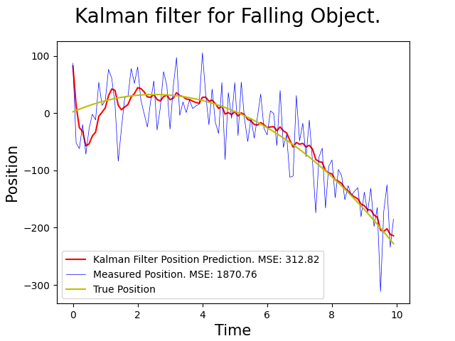
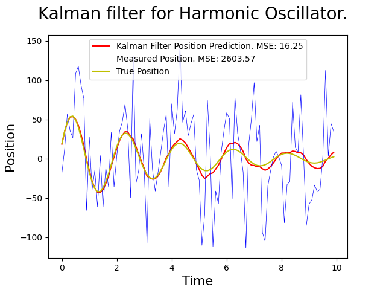

# kalman-filter

An implementation of the Kalman filter for predicting the dynamics of a falling object based on noisy observations.

## How to run

1) Clone the repo.

2) `pip install -r requirements.txt`

3) Execute the file `kalman-filter.py`. This will generate a graph displaying the measured position, actual position, and predicted position via Kalman filter over time. Aditionally, the MSE of the measured position and the predicted position will be printed.

## Systems

### Falling Object

The falling object system models a solution to the ode $x''(t) = g$ where $x(t)$ is the position and the constant $g$ is set to $-9.81$. Expanding with Taylor series, we get 

$$
x(t + \Delta t) = x(t) + \Delta t x'(t) + \frac{\Delta t ^2}{2} x''(t) + O(\Delta t ^3)
$$

Setting the discrete position $x_k = x(k \Delta t)$ and discrete velocity $v_k = x'(k \Delta t)$, and ignoring $O(\Delta t ^3)$ terms, we get the finite difference equations:

$$
\begin{align}
x_{k+1} &= x_k + \Delta t v_k + \frac{\Delta t ^2}{2} g \\
v_{k+1} &= v_k + \Delta t g
\end{align}
$$

The state vector is the position and velocity of the system:
```math
\textbf{x}_k = \begin{bmatrix} x_k \\ v_k \end{bmatrix}
```



### Harmonic Oscillator

