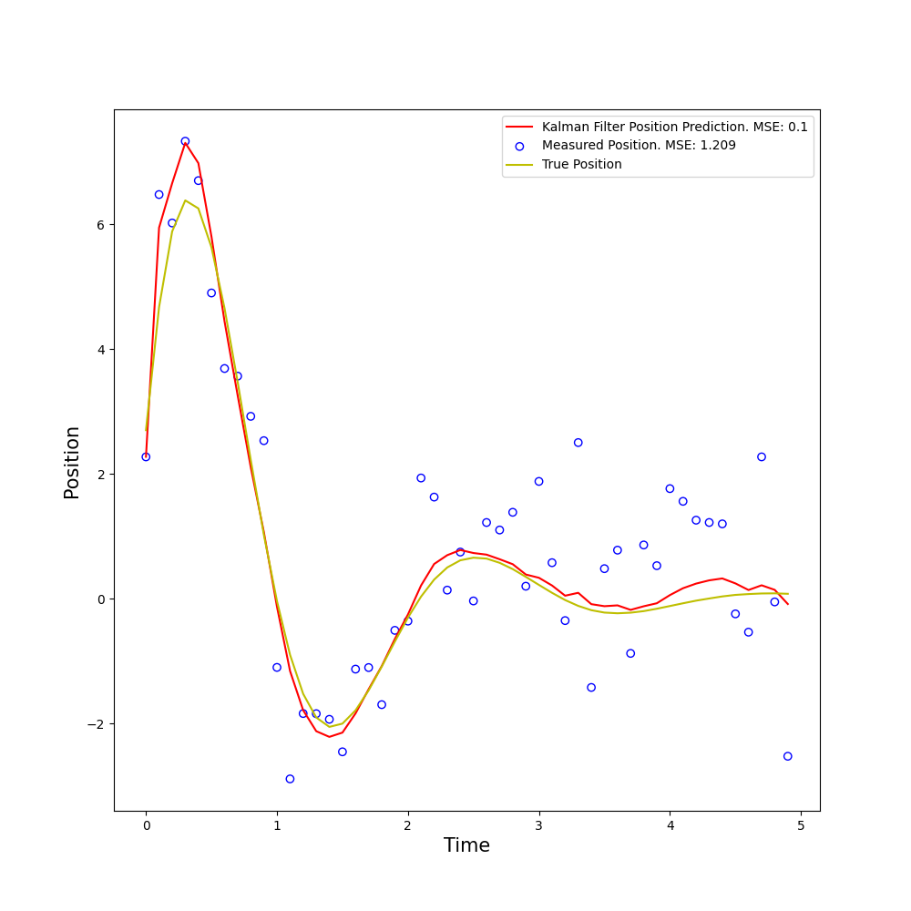

# kalman-filter

An implementation of the Kalman filter for predicting the dynamics of a falling object based on noisy observations.

## How to run

1) Clone the repo.

2) `pip install -r requirements.txt`

3) Execute the file `kalman-filter.py`. This will generate a graph displaying the measured position, actual position, and predicted position via Kalman filter over time. Aditionally, the MSE of the measured position and the predicted position will be printed.

## Kalman Filter

## Systems

### Falling Object

The falling object system models a solution to the ode $x'' = g$ where $x(t)$ is the position and the constant $g$ defaults to $-9.81$. Expanding with Taylor series, we get 

$$
x(t + \Delta t) = x(t) + \Delta t x'(t) + \frac{\Delta t ^2}{2} x''(t) + O(\Delta t ^3).
$$

Because $x''$ is constant, all higher order terms are zero.

Setting the discrete position $x_k = x(k \Delta t)$ and discrete velocity $v_k = x'(k \Delta t)$, we get the finite difference equations

$$
\begin{align}
x_{k+1} &= x_k + \Delta t v_k + \frac{\Delta t ^2}{2} g \\
v_{k+1} &= v_k + \Delta t g.
\end{align}
$$

The state vector is the position and velocity of the system
```math
\textbf{x}_k = \begin{bmatrix} x_k \\ v_k \end{bmatrix}.
```

We can formulate the above equations in matrix form
```math
\begin{bmatrix} x_{k+1} \\ v_{k+1} \end{bmatrix} = \begin{bmatrix} 1 & \Delta t \\ 0 & 1\end{bmatrix} \begin{bmatrix} x_k \\ v_k \end{bmatrix} + \begin{bmatrix} \frac{\Delta t ^2}{2} \\ \Delta t \end{bmatrix} g.
```

This means that the state transition matrix $A$, control matrix $B$, and control vector $u$ is
```math
\begin{align}
A &= \begin{bmatrix} 1 & \Delta t \\ 0 & 1\end{bmatrix} \\
B &= \begin{bmatrix} \frac{\Delta t ^2}{2} \\ \Delta t \end{bmatrix} \\
\mathbf{u} &= g.
\end{align}
```

Let us assume that our acceleration due to gravity has normally distributed noise with mean $0$ and standard deviation $\sigma_a = 0.25$. This means that the position and velocity also have normally distributed noise with standard deviation $\sigma_x = \frac{\Delta t^2}{2} \sigma_a$ and $\sigma_v = \Delta t \sigma_a$ respectively. So the process noise vector is

```math
\mathbf{w}_k = \begin{bmatrix} w_x \\ w_v \end{bmatrix}.
```

Where $w_x \sim \mathcal{N}(0,\sigma_x)$ and $w_v \sim \mathcal{N}(0, \sigma_v)$. Therefore, our process nosie covariance matrix $Q$ is

```math
Q = \begin{bmatrix}\sigma_x^2 & \sigma_x \sigma_v \\ \sigma_x \sigma_v& \sigma_v^2\end{bmatrix}.
```

We will only measure position in this system. Therefore, our transformation matrix $H$ is 

```math
H = \begin{bmatrix} 1 & 0\end{bmatrix}.
```

Let us assume that our measurement noise has standard deviation $\sigma_z = 5$. Then our measurement noise vector $\mathbb{v}_k$ is a constant such that $\mathbb{v}_k \sim \mathcal{N}(0,\sigma_z).$ This implies that our measurement noise covariance matrix $R$ is also a constant and $R = \sigma_z^2$.

Running the simulation, we get the following results


### Dampened Oscillator

The dampened oscillator system solves the ode $mx'' + bx' + kx = 0$.

This system is similar to the falling object as it is a second order ODE. Solving for $x''$ we get

```math
x'' = -\frac{b}{m}x' - \frac{k}{m}x.
```

Again by expanding with taylor series, substituting for $x''$, ignoring higher order terms, we get

$$
\begin{align}
x(t + \Delta t) &= x(t) + \Delta t x'(t) + \frac{\Delta t ^2}{2} x''(t) + O(\Delta t^3) \\
&= (1 - \frac{k}{2m} \Delta t ^2) x(t) + (\Delta t - \frac{b}{2m} \Delta t^2) x'(t) \\
x'(t + \Delta t) &= x'(t) + \Delta t x''(t) + \frac{\Delta t ^2}{2} x'''(t) + O(\Delta t^3) \\
&= x'(t) + \Delta t (-\frac{k}{m}x(t) - \frac{b}{m}x'(t)) + \frac{\Delta t ^2}{2} (\frac{bk}{m^2}x(t) + (\frac{b^2}{m^2} - \frac{k}{m})x'(t)) \\
&= (-\frac{k}{m} \Delta t + \frac{bk}{2m^2} \Delta t ^2)x(t) + (1 - \frac{b}{m} \Delta t + \frac{b^2 -mk}{2m^2} \Delta t ^2) x'(t)
\end{align}
$$

Letting letting $x_k = x(k \Delta t)$ and $v_k = x'(k \Delta t)$, we get $\mathbf{x}_{k+1} = A \mathbf{x}_k$, where

```math
\begin{align}
\mathbf{x}_k &= \begin{bmatrix} x_k \\ v_k \end{bmatrix} \\
A &= \begin{bmatrix} 1 - \frac{k}{2m} \Delta t^2 & \Delta t - \frac{b}{2m} \Delta t^2 \\
-\frac{k}{m} \Delta t + \frac{bk}{2m^2} \Delta t ^2 & 1 - \frac{b}{m} \Delta t + \frac{b^2 -mk}{2m^2} \Delta t ^2 \end{bmatrix}
\end{align}
```



## Sources

Welch, Greg, and Gary Bishop. "An introduction to the Kalman filter." (1995): 2.

Rahmadsadli. “Object Tracking: Simple Implementation of Kalman Filter in Python.” Machine Learning Space, 8 Nov. 2023, [machinelearningspace.com/object-tracking-python](https://machinelearningspace.com/object-tracking-python/).
